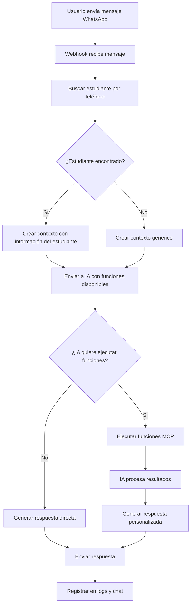

# Sistema MCP (Model Context Protocol) para WhatsApp

## 🚀 Descripción

Este sistema convierte tu servidor de WhatsApp en un **MCP Server** más dinámico e independiente, permitiendo que la IA tenga acceso a funciones auxiliares para consultar información específica de estudiantes según la matrícula y responder de forma personalizada.

## 🏗️ Arquitectura

### Componentes Principales

1. **MCPServerService** (`app/Services/MCPServerService.php`)
   - Servidor de funciones auxiliares
   - Maneja consultas a la base de datos
   - Proporciona información de estudiantes, pagos, asistencias, etc.

2. **AIFunctionService** (`app/Services/AIFunctionService.php`)
   - Servicio de integración IA-MCP
   - Maneja Function Calling de OpenAI
   - Procesa respuestas dinámicas con contexto

3. **WhatsAppController** (modificado)
   - Controlador principal de WhatsApp
   - Integra el sistema MCP
   - Nuevos endpoints para testing

## 🔧 Funciones Disponibles

### Funciones de Consulta de Estudiantes

| Función | Descripción | Parámetros |
|---------|-------------|------------|
| `get_student_by_matricula` | Buscar estudiante por matrícula | `matricula` (string) |
| `get_student_by_phone` | Buscar estudiante por teléfono | `phone_number` (string) |
| `get_student_payments` | Obtener transacciones/pagos | `student_id` (int), `limit` (int, opcional) |
| `get_student_grades` | Información académica y promedio | `student_id` (int) |
| `get_student_schedule` | Información de grupo y horarios | `student_id` (int) |
| `get_student_attendance` | Registro de asistencias | `student_id` (int), `date_from` (opcional), `date_to` (opcional) |
| `get_student_profile` | Perfil completo del estudiante | `student_id` (int) |
| `search_students` | Buscar estudiantes por criterios | `query` (string), `limit` (int, opcional) |

## 🌐 Endpoints API

### Endpoints MCP

**Base URL:** `/api/whatsapp/mcp/`

#### 1. Probar Respuesta Automática con MCP
```http
POST /api/whatsapp/mcp/test
Content-Type: application/json

{
  "phone_number": "+52XXXXXXXXXX",
  "message": "¿Cómo van mis pagos?",
  "send_response": false
}
```

#### 2. Ejecutar Función MCP Específica
```http
POST /api/whatsapp/mcp/execute
Content-Type: application/json

{
  "function_name": "get_student_by_matricula",
  "parameters": {
    "matricula": "12345"
  }
}
```

#### 3. Obtener Funciones Disponibles
```http
GET /api/whatsapp/mcp/functions
```

#### 4. Buscar Estudiante por Matrícula
```http
GET /api/whatsapp/mcp/student/matricula?matricula=12345
```

#### 5. Obtener Perfil Completo
```http
GET /api/whatsapp/mcp/student/profile?student_id=123
```

## 💬 Funcionamiento en WhatsApp

### Flujo de Procesamiento

1. **Mensaje Recibido**: Usuario envía mensaje por WhatsApp
2. **Identificación**: Sistema busca al estudiante por número de teléfono
3. **Contexto Dinámico**: IA recibe información del estudiante encontrado
4. **Function Calling**: IA decide qué funciones necesita ejecutar
5. **Ejecución**: Sistema ejecuta las funciones solicitadas
6. **Respuesta**: IA genera respuesta personalizada con los datos obtenidos

### Ejemplos de Interacciones

#### Consulta de Pagos
```
Usuario: "¿Cómo van mis pagos?"
Sistema: 
- Identifica estudiante por teléfono
- Ejecuta get_student_payments()
- Responde: "Hola Juan! 📊 Tienes 2 pagos pendientes por $1,500. Tu último pago fue el 15 de enero por $800. ¿Necesitas ayuda con algo específico?"
```

#### Consulta de Asistencias
```
Usuario: "¿Cómo va mi asistencia?"
Sistema:
- Ejecuta get_student_attendance()
- Responde: "¡Excelente asistencia María! 📚 Tienes 95% de asistencia (19 de 20 clases). Solo has faltado 1 día este mes. ¡Sigue así! 👏"
```

#### Información General
```
Usuario: "¿Qué información tienes de mí?"
Sistema:
- Ejecuta get_student_profile()
- Responde: "📋 Tu perfil: Matrícula 12345, Carrera de Sistemas, Promedio 8.5, Campus Centro. Todo está actualizado! ¿Hay algo específico que quieras saber?"
```

## 🔧 Configuración

### Variables de Entorno
Asegúrate de tener configuradas:

```env
# OpenAI
OPENAI_API_KEY=tu_api_key_aqui

# WhatsApp
WHATSAPP_TOKEN=tu_token_aqui
PHONE_NUMBER_ID=tu_phone_id_aqui
WHATSAPP_VERIFY_TOKEN=tu_verify_token_aqui
```

### Modelos Requeridos
El sistema usa los siguientes modelos de tu base de datos:
- `Student` - Información de estudiantes
- `Transaction` - Transacciones/pagos
- `Attendance` - Registro de asistencias

## 🧪 Testing

### 1. Probar Función Individual
```bash
curl -X POST http://localhost:8000/api/whatsapp/mcp/execute \
  -H "Content-Type: application/json" \
  -d '{
    "function_name": "get_student_by_matricula",
    "parameters": {"matricula": "12345"}
  }'
```

### 2. Probar Respuesta Completa con IA
```bash
curl -X POST http://localhost:8000/api/whatsapp/mcp/test \
  -H "Content-Type: application/json" \
  -d '{
    "phone_number": "+52XXXXXXXXXX",
    "message": "¿Cómo van mis pagos?",
    "send_response": false
  }'
```

### 3. Ver Funciones Disponibles
```bash
curl http://localhost:8000/api/whatsapp/mcp/functions
```

## 📊 Logs y Monitoreo

El sistema registra:
- Funciones MCP ejecutadas
- Estudiantes identificados
- Tokens de IA utilizados
- Errores y respuestas

Revisa los logs en `storage/logs/laravel.log` para monitorear el funcionamiento.

## 🔄 Flujo Completo



## 🚨 Consideraciones Importantes

1. **Privacidad**: El sistema solo accede a información del estudiante que hace la consulta
2. **Performance**: Las funciones están optimizadas para respuestas rápidas
3. **Fallback**: Si falla el MCP, el sistema tiene respuestas de respaldo
4. **Escalabilidad**: Fácil agregar nuevas funciones MCP según necesidades

## 🔮 Funciones Futuras

- Integración con horarios de clases
- Notificaciones proactivas de pagos
- Consulta de calificaciones detalladas
- Reserva de citas y servicios
- Integración con sistema de tareas

---

**¡El sistema está listo para usar!** 🎉

Ahora tu WhatsApp Bot puede responder preguntas específicas sobre cada estudiante de manera inteligente y dinámica.